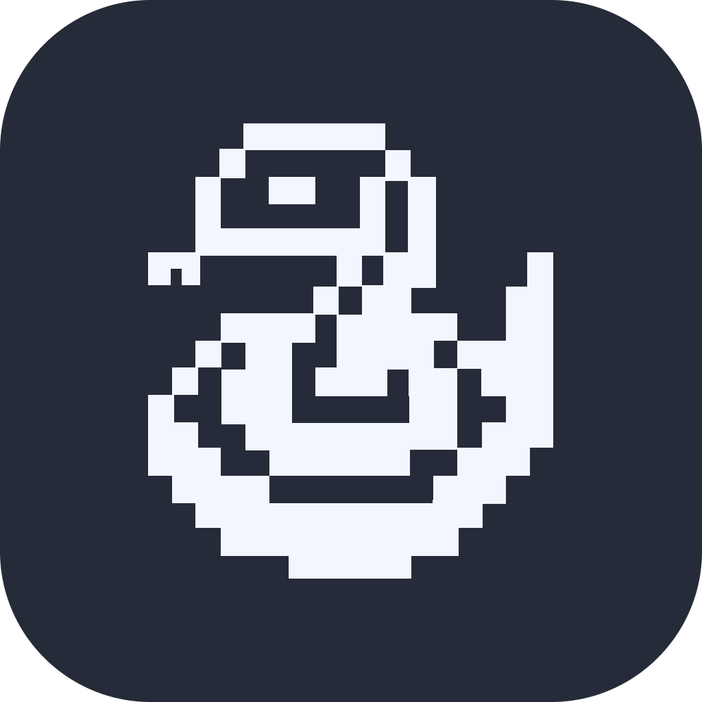
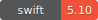
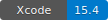
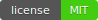
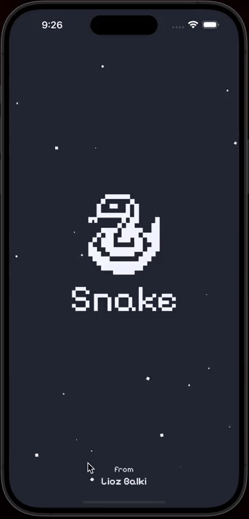
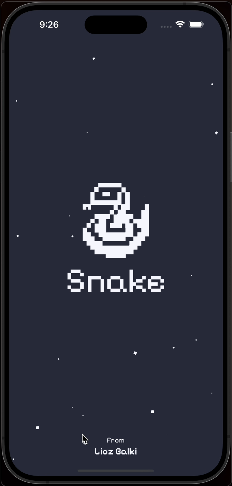
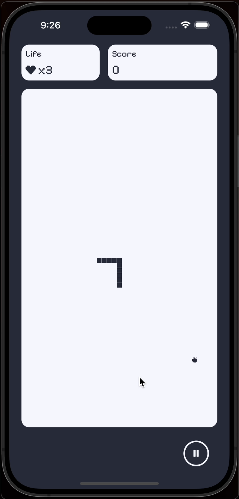
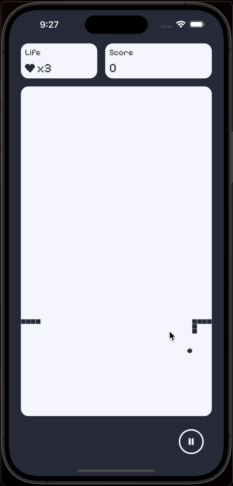

<p align="center">
   
</p>

<p align="center">
    <a href="https://swift.org/about/#swiftorg-and-open-source"></a>
    <a href="https://developer.apple.com/xcode/"></a>
    <a href="http://doge.mit-license.org"></a>
</p>


## Overview

<p float="center"> 
 
 
 
 
</p>

A modern take on the classic Snake game, built using **SceneKit** and **UIKit**. This project leverages the power of SceneKit for a smooth 2D-rendered experience and integrates seamlessly with UIKit for user interaction. The game features customizable snake behavior, real-time game state management, and dynamic game board interactions.

## Key Components

</p></details>
<details><summary>SCSnake</summary><p>

### Overview ###
The `SCSnake` class is responsible for managing the snake's segments, including the head and body. It handles core game functionalities such as initializing the snake, managing its segments, and controlling its interactions with the game board.

### Purpose ###
The `SCSnake` class manages the snake's lifecycle, from its initial creation to its growth and repositioning on the game board. It ensures that the snake's segments are correctly placed, removed, and updated as the game progresses.

### Key Functions ###

- **die**
  - Resets the snake to its initial state. This function reinitializes the head and body when the snake dies.
    
- **isLocated**
  - Checks if any part of the snake (head or body) is located at a given grid position `(x, y)`. 
  - Returns `true` if the snake occupies the specified coordinates.
  
- **detach**
  - Resets the snake's segments by setting all their positions and their `holder` values to `nil`. 
  - Used when the snake needs to be removed from the game board.
  
- **reposition**
  - Repositions the snake on the game board. The snake's head is placed in the center of the board, and the body segments are placed behind the head.
  - This method ensures that the snake is correctly positioned when the game starts or is reset.
  
- **addSegment**
  - Adds a new segment to the snake's body. The new segment is placed at the position of the last segment, extending the snake's body.
  - This function is called when the snake consumes fruit, making the snake grow.
  
### Summary ###
The `SCSnake` class is the backbone of the snake's functionality in the game. It handles everything from initializing the snake, growing the snake when fruit is consumed, to managing its movement and repositioning on the board. It also allows for easy manipulation of the snake’s segments, making it possible to reset or reposition the snake whenever necessary.

</p></details>
</div>

</p></details>
<details><summary>SCSnakeBoard</summary><p>

### Overview ###
The `SCSnakeBoard` class is responsible for setting up the game board's grid, where the snake moves and interacts with objects like fruit. It extends `SCNNode` from SceneKit, meaning it represents a 2D object in the SceneKit environment. This class handles the layout of the game board, the columns where the snake and fruit reside, and manages the arrangement of rows and columns.

### Purpose ###
The primary responsibility of `SCSnakeBoard` is to dynamically create and manage the grid structure of the game. It generates rows and columns based on the visible area of the view, ensuring that the board scales correctly across different screen sizes.

### Key Functions ###

- **clean**
  - Clears the board by removing all child nodes (columns and rows) and resetting the `rows` array. This method is typically used when the game board needs to be reset or rearranged.

- **arrange**
  - Dynamically arranges the game board based on the dimensions of the view. This function calculates the size and position of each row and column based on the visible width and height of the `SCSnakeView`. It ensures that the board scales according to the screen size, which is essential for consistent gameplay across different devices.
  
  - The board is arranged only if the current `meta` (metadata about the grid dimensions) does not match the visible size of the view. The method then calculates the size of each column and row, and positions them accordingly.
  
  - Each column is added to the board as an `SCNNode`.

### Summary ###
The `SCSnakeBoard` class is the backbone of the game’s grid system. It manages the creation and layout of rows and columns, ensuring that the snake has a well-defined space to move. The class is highly dynamic, adapting to different screen sizes by adjusting the board’s dimensions to fit the visible area of the view. This ensures that the game is playable on various device sizes without compromising gameplay.

</p></details>
</div>

</p></details>
<details><summary>SCSnakeFruit</summary><p> 

### Overview ###
The `SCSnakeFruit` class manages the appearance, positioning, and behavior of the fruit on the snake game board. The fruit is placed randomly on the board, and its interaction with the snake is vital to the game mechanics. It extends SCSnakeBoardDrawable, indicating that it can be drawn on the game board.

### Purpose ###
The primary role of `SCSnakeFruit` is to control the location of the fruit on the game board and manage its interactions with the snake. The class is responsible for selecting a random position for the fruit and updating its location as needed.

### Key Functions ###

- **detach**
  - Detaches the fruit from the game board by resetting its position and clearing its holder. This method is called when the fruit needs to be removed from its current position.

- **reposition**
  - Repositions the fruit in a random column on the board. It first retrieves a random column that is not currently occupied (via board.randomColumn) and then assigns the fruit to that position.
  
  - This function ensures that the fruit appears in a new random location whenever needed, such as after the snake consumes a fruit.

### Summary ###
The `SCSnakeFruit` class is responsible for managing the fruit in the snake game. It controls the fruit’s placement on the game board and ensures that it appears in a random, unoccupied spot when needed. The class also allows for flexible positioning and removal of the fruit from the board, making it an essential part of the game’s growth and scoring mechanics.


</p></details>
</div>

</p></details>
<details><summary>SCSnakeMetaData</summary><p> 

### Overview ###
The `SCSnakeMetaData` struct is responsible for tracking and updating game metadata like the player's life, score, and the current game state. It uses property observers to notify other parts of the game whenever these values change, allowing for dynamic updates and reactions to player actions.

### Purpose ###
The `SCSnakeMetaData` class serves as the central repository for important game-related data. It tracks the player’s current score, the number of lives remaining, and the state of the game. This information is crucial for determining how the game progresses and how the user interface should be updated.

### Key Functions ###

- **life(_ target: NSObject) -> any ReciveablePropertyObserve<Int>**
  - Observes changes to the `life` property. This function allows other components (like the UI or game logic) to observe the player’s life count and react whenever it changes.

- **score(_ target: NSObject) -> any ReciveablePropertyObserve<Int>**
  - Observes changes to the `score` property. This function is useful for updating the UI whenever the player's score changes.

- **state(_ target: NSObject) -> any ReciveablePropertyObserve<SCSnakeState>**
  - Observes changes to the `state` property. Other components can subscribe to these changes and react when the game transitions from one state to another (for example, updating the UI when the game is paused or over).

### Protocols ###

- **SCSnakeData Protocol**
  - This protocol ensures that any class or struct conforming to `SCSnakeData` has the properties required to track the player's life, score, and game state.
  
- **SCSnakeMetaObservable Protocol**
  - This protocol defines methods for observing changes in life, score, and state. Classes or structs conforming to this protocol can expose these methods for observing game data.
  
### Summary ###
The `SCSnakeMetaData` class is the central data store for key game metrics like the player's life count, score, and current game state. It uses observable properties to track and notify other parts of the game when these values change. This design allows for dynamic updates to the user interface and other components that depend on the game’s current state.

</p></details>
</div>

## Usage Instructions
The `SCSnakeView` class is the primary view for the snake game, built using SceneKit and UIKit. It manages the core game components, including the snake, game board, fruit, and user inputs (via gestures). This view handles the game logic such as starting, stopping, pausing, and updating the game state.

- **Key Components**
  - **Snake**: The snake that the player controls.
  - **Board**: The grid where the snake moves and fruit is placed.
  - **Fruit**: The object that the snake must consume to grow.
  - **Game Progress**: Tracks game time and updates.
  - **Gesture Handling**: Uses `UIPanGestureRecognizer` to control the snake's direction.

### Initializing the Game ###

To create a new instance of the snake game and integrate it into your app, simply initialize `SCSnakeView` and add it to your main view.

```swift
let snakeView = SCSnakeView(frame: view.bounds)
view.addSubview(snakeView)
```

This will add the `SCSnakeView` to your current view and set up all necessary game components.

### Starting the Game ###

The game can be started by calling the **`start()`** method. This method checks the current state of the game and either resumes, starts fresh, restarts after game over, or recovers from a snake bite.

```swift
snakeView.start()
```

You can also delay the game start with a specified time using:

```swift
snakeView.start(after: 2.0)  // Start after a 2-second delay
```

### Stopping and Pausing the Game ###
The game can be stopped or paused using the stop() method. This will only take effect if the game is currently running.

```swift
snakeView.stop()
```

When stopped, the game will remain in the paused state until resumed.

<br>

# Explore and Modify
This section is designed to help developers explore the core structure of the game and understand how to modify various aspects of the snake game to suit their needs. From changing the snake's speed to customizing the game board, the `SCSnakeView` and related classes offer plenty of opportunities for fine-tuning and expanding the game.

## Modify Snake Behavior ##

### Changing the Snake’s Speed ###
The snake’s speed is controlled by the progress timer in the `SCSnakeView` class. To change the snake's speed, adjust the time interval passed to `progress.schedule(time:)`.

```swift
fileprivate func run() {
    self.metaData.state.change(to: .running)
    self.progress.schedule(time: 0.1) // Increase or decrease this value to adjust speed
}
```

- **Decrease the interval**: (e.g., `0.05`) to make the snake move faster.
- **Decrease the interval**: (e.g., `0.20`) to slow the snake down.

### Snake Growth ###
The snake grows each time it consumes fruit, which is handled by the `addSegment(in:)` method in the SCSnake class. If you want the `snake` to grow faster or slower (i.e., more or fewer segments per fruit), modify this behavior in the `addSegment(in:)` method.

```swift
internal func addSegment(in board: SCSnakeBoard) {
    // Modify the logic here to change how many segments the snake grows
    body.insert(Segment(), at: body.count)
}
```

## Customize the Game Board ##
The game board is dynamically created based on the dimensions of the screen in the `SCSnakeBoard` class. You can modify the number of rows and columns or change the size of each grid cell.

### Changing the Board Grid ###
To modify the board's structure, adjust the row and column dimensions in the SCSnakeBoard class:

```swift
internal func arrange(for view: SCSnakeView) {
    meta.set(width: view.rect.visible.width)
    meta.set(height: view.rect.visible.height)

    for r in 0...meta.y.max {
        var row = Row(r)
        for c in 0...meta.x.max {
            // You can modify how rows and columns are created here
            let column = Column(r, c, meta.columnWidth, meta.columnHeight, cx, cy).draw()
            row.append(column)
        }
        rows.append(row)
    }
}
```

## Modify Fruit Behavior ##
The `SCSnakeFruit` class controls how and where fruit appears on the game board. By default, fruit is placed randomly in unoccupied cells. You can change how often fruit appears, its appearance, or even add different types of fruit.

### Change Fruit Appearance ###
The fruit's visual representation is stored as an image, which can be modified in the `SCSnakeFruit` initializer:

```swift
internal init(uuid: UUID = UUID(), image: UIImage? = .init(named: "snake_fruit")) {
    self.uuid     = uuid
    self.material = image // Replace "snake_fruit" with any other image asset
}
```

To customize the fruit, simply replace `"snake_fruit"` with the name of another image in your assets.

### Randomize Fruit Location ###
The fruit is repositioned randomly on the board using the ` reposition(in:)` method. You can modify how and when the fruit appears by changing the logic in this method:

```swift
internal func reposition(in board: SCSnakeBoard) {
    guard let column = board.randomColumn else {
        return
    }
    self.set(row: column.row)
    self.set(column: column.index)
    self.set(holder: column).holder?.draw()
}
```

## Modify Game State Logic ##
The game state is managed by `SCSnakeMetaData`, which tracks the current game state, score, and life count. You can modify how the game handles various states such as game over, paused, or running.

### Change Game Over Logic ###

The game enters the `gameOver` state when the snake bites itself or runs out of lives. You can modify the conditions for game over in the update() method in `SCSnakeView`:

```swift
if snake.isLocated(in: vector.x, vector.y) {
    return invalidate(with: metaData.life > 0 ? .snakeBite : .gameOver)
}
```

- Modify the `metaData.life` logic to change how many lives the player has, or introduce new game over conditions.

### Adjust Score Calculation ###

The player's score is updated whenever the snake consumes fruit. This is handled in the `update()` method:

```swift
if fruit.isLocated(in: vector.x, vector.y) {
    metaData.score += 1 // Change this to modify score increments
    fruit.reposition(in: board)
    snake.addSegment(in: board)
}
```

- **Increase or decrease the score increment** by modifying `metaData.score += 1` to suit your gameplay needs.

<br>

# Installation Instructions
Follow these steps to set up and run the Snake project on your local machine:

**Clone the Repository**: Begin by cloning the repository to your local machine using Git. Open your terminal and run the following command:

```
git clone https://github.com/lioz12131415/Snake.git
cd Snake
```
**Open the Project in Xcode**

```
open Snake.xcodeproj
```

<br>

# Acknowledgments
This project was built using several powerful frameworks and resources. Special thanks to the following:

- [Apple's SceneKit Framework](https://developer.apple.com/documentation/scenekit): For providing an incredible 2D rendering engine that made the snake game possible with smooth animations and object manipulation.

- [UIKit](https://developer.apple.com/documentation/uikit): For handling the user interface, gestures, and interactions seamlessly, making it easy to control the game with intuitive swipes and gestures.

- [Swift Language](https://www.swift.org/): For its modern, safe, and powerful features that allowed for flexible game development and customization.

- **Open Source Contributors**: 
  - Special thanks to open-source projects and the iOS developer community for contributing insights, tools, and techniques that influenced the design of this project.

- **Inspiration**: 
  - The classic Snake Game, which has been a source of endless fun and inspiration for generations of players.


## License
This project is licensed under the MIT License. See the [LICENSE](./LICENSE) file for more details.
